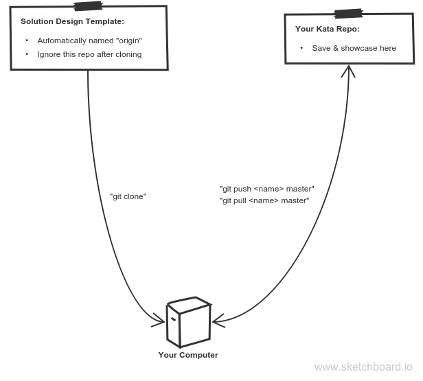

# Setup

1. Clone the [Template Repo](https://github.com/elewa-academy/solution-design-template) into a new directory
2. Customize the directory for your Kata:
    * Rename the directory
    * Re-title the README
    * Link the title to your Kata
3. Create a new repo on your GH account 
    * _Do not initialize with a README_
    * Name it after the Kata 
4. Add the new repo as a remote from your terminal ("git remote add ...")
5. Git push to your new repo
6. Update your github repository:
    * Change the gh-pages settings to build from master
    * Add a link to your live tests in the repo description
7. Add links to the repository and live tests in your Solution Design Gallery. 
8. Work on the challenge from your local text editor, running tests from the browser with "index.html". 
9. Save your work by pushing to your GitHub account

___

## GitHub Work-Flow Diagram

___

## Resources

* [Cloning a Repo](https://help.github.com/articles/cloning-a-repository/)
* [Adding Remote Repos](https://help.github.com/articles/adding-a-remote/)

___
___
### 